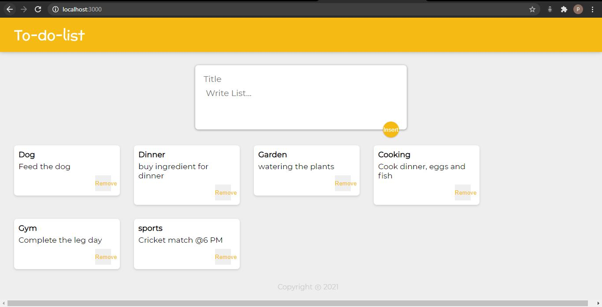

# To-do-List-React
A do-lot-list frontend made with react having insert and delete functionality. 

• Components, hooks (useState) are used

• Dynamically displaying notes on the web page

• New notes can be added to the web app using spread operator, map function and custom elements

• Reusable components

